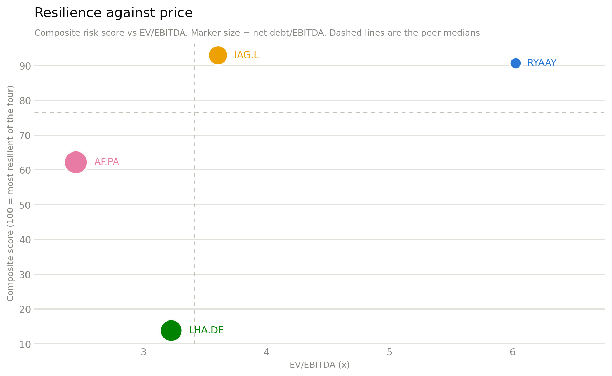

# Airline liquidity risk

Four European carriers, two questions. How long does each one survive a demand shock — and does the market charge for that survival? Everything here is computed from filed annual statements by <a href="notebook/main.ipynb">one reproducible notebook</a>.

| Carrier | Ticker | Latest FY | Reporting currency |
|---|---|---|---|
| Ryanair Holdings | `RYAAY` | Mar 2026 | EUR (USD ADR quote) |
| Deutsche Lufthansa | `LHA.DE` | Dec 2025 | EUR |
| Air France-KLM | `AF.PA` | Dec 2025 | EUR |
| International Airlines Group | `IAG.L` | Dec 2025 | EUR (GBP quote) |

## What the numbers say

**1. All four are funded by their customers, and the float is shrinking.** Every carrier runs a negative cash conversion cycle — passengers pay before they fly, suppliers are paid after. But the cycle has compressed toward zero at all four over four years, driven almost entirely by falling days payable. Air France-KLM has effectively lost the benefit: its CCC is now **-0.7 days**, against Ryanair's -17.4 and IAG's -17.6.

**2. Current ratios below 1.0 are the norm here, not a warning.** All four sit between 0.62x and 0.90x, because unflown-ticket deferred revenue is booked as a current liability that will be settled with aircraft seats, not cash. The cash ratio is the ratio that discriminates — and it separates Lufthansa (**0.06x**) from everyone else by an order of magnitude.

**3. Lufthansa is the outlier on shock tolerance.** Under a sustained revenue shock with 55% variable cost, Lufthansa's breakeven is a **-24%** decline; the other three absorb -39% to -43% before burning cash at all. In a COVID-scale -70% shock, Lufthansa has **1.5 months** of cash against IAG's 16.7.

**4. The resilience ranking is real at the bottom and a coin-flip at the top.** IAG and Ryanair score 92.9 and 90.7 on a weighted composite; re-run at equal weights they swap. Lufthansa scores 13.8 under every weighting tested. Read the top as a tie and the bottom as a verdict.

**5. Resilience is priced.** Rank correlation between the composite score and EV/EBITDA is **+0.60**. The two resilient carriers are the two expensive ones; the two fragile carriers are the two cheap ones. Nothing sits in the resilient-and-cheap quadrant.

<figure markdown>
  
  <figcaption>The two halves of the analysis meet: balance-sheet resilience on the x-axis, what the market charges for it on the y-axis.</figcaption>
</figure>

## Where to start

-   :material-cash-clock: **[Working capital & the cash cycle](working-capital.md)**

    DSO, DPO, DIO and CCC over four fiscal years — where the customer float comes from and why it is eroding.

-   :material-water: **[Liquidity ratios](liquidity.md)**

    Current, quick and cash ratios, and why only the last one carries information for an airline.

-   :material-trending-down: **[Liquidity stress test](stress-test.md)**

    Months of cash under a sustained revenue shock, swept continuously, with the cost-split assumption stressed.

-   :material-podium: **[Composite risk ranking](composite-risk.md)**

    Five metrics into one score — and an honest account of how much the weights move it.

-   :material-scale-balance: **[Enterprise value & multiples](valuation.md)**

    The lease-inclusive EV bridge and the trading multiples it feeds.

-   :material-chart-scatter-plot: **[Is resilience priced?](risk-vs-value.md)**

    The scatter, the quadrants and what a rank correlation at n=4 can and cannot say.

!!! warning "Scope"
    This is an educational analysis of public filings, built to demonstrate financial-statement modelling in Python. It is not investment advice, not a recommendation, and not a substitute for reading the accounts. Figures come from Yahoo Finance's normalised statement feed and have not been tied back to the primary annual reports — see [Limitations](limitations.md).
