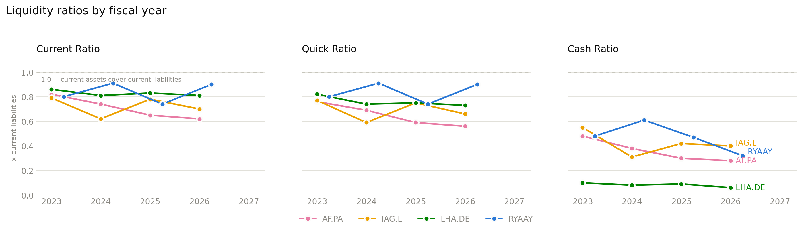

# Liquidity ratios

Three ratios over the same denominator. For an airline, only one of them carries information — and it separates Lufthansa from the field by an order of magnitude.

## The three ratios

All three divide by current liabilities and differ only in what counts as available to pay them:

| Ratio | Numerator | Reads as |
|---|---|---|
| Current | Current assets | Everything short-term, inventory included |
| Quick | Current assets − inventory | Excludes stock that must be sold first |
| Cash | Cash & equivalents | Only what is already money |

<figure markdown>
  
  <figcaption>Shared axes across all three panels, so the drop from Current to Cash is directly readable. The dashed line at 1.0x marks current assets exactly covering current liabilities.</figcaption>
</figure>

## Below 1.0x is normal here

Every carrier, in every year, sits under 1.0x on the current ratio — between 0.62x and 0.91x. In most industries that reads as a warning. In an airline it mostly reflects **deferred revenue**: tickets sold for flights not yet flown are a current liability, and they are settled by operating the flight, not by paying cash. A carrier growing forward bookings pushes its current ratio *down*.

That makes the current ratio close to useless for ranking these four, and the quick ratio barely better — airline inventory is small (0.1 to 17 days of COGS), so quick tracks current almost exactly.

The **cash ratio** is the one that discriminates, because it asks the only question that matters in a shock: how much actual money is against near-term obligations?

## Latest fiscal year

| Ticker | Current | Quick | Cash |
|---|---|---|---|
| RYAAY | 0.90 | 0.90 | 0.32 |
| LHA.DE | 0.81 | 0.73 | **0.06** |
| IAG.L | 0.70 | 0.66 | 0.40 |
| AF.PA | 0.62 | 0.56 | 0.28 |

The ranking flips depending on which ratio you read. Lufthansa has the *second-best* current ratio (0.81x) and by far the worst cash ratio (0.06x) — a 13x gap to IAG. Whatever is in Lufthansa's current assets, it is not cash.

Air France-KLM is the mirror-image caution: worst on current (0.62x) but mid-pack on cash (0.28x).

!!! tip "Read the panels together"
    The interesting quantity is the *drop* from the current panel to the cash panel, not the level in either. A carrier whose three bars are close together holds its short-term assets as money. A carrier whose cash bar collapses relative to its current bar is holding receivables, prepayments and derivative assets that will not be there on the day of a shock.

## Trend

Cash ratios fell at three of the four over the window:

| Ticker | Earliest FY | Latest FY |
|---|---|---|
| RYAAY | 0.48 | 0.32 |
| LHA.DE | 0.10 | 0.06 |
| AF.PA | 0.48 | 0.28 |
| IAG.L | 0.55 | 0.40 |

This is the post-pandemic normalisation: the sector raised emergency liquidity in 2020–21 and has spent the years since paying it down, buying aircraft and — at Ryanair and IAG — returning capital. Lower cash is a deliberate choice, not a deterioration. The question the [stress test](stress-test.md) asks is whether the remaining balance is enough.

## Data

- [`working_capital_ratios.csv`](assets/working_capital_ratios.csv) — all 16 carrier-years.
