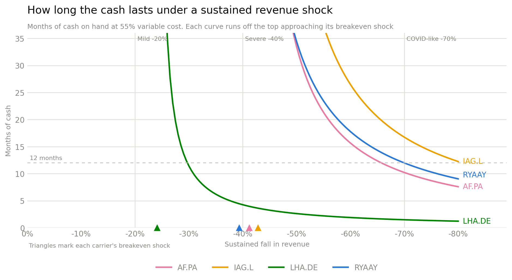

# Liquidity stress test

<p class="lede">Ratios describe a balance sheet at rest. This asks the operating question: if demand collapses and stays collapsed, how many months does the cash last?</p>

## The model

Revenue falls by a shock `s` and stays there. Variable cost — fuel, handling, airport and distribution fees, variable crew — falls with it. Fixed cost — fleet ownership, base maintenance, salaried crew, admin — does not. The gap is monthly cash burn:

```text
monthly burn = (fixed cost + (1 - s) × variable cost - (1 - s) × revenue) / 12
months of liquidity = cash / monthly burn
```

where the cost base is **cost of revenue** as reported, split **55% variable / 45% fixed** — the conventional short-haul assumption. SG&A and other operating lines below cost of revenue are not in the burn, so the runways here are, if anything, generous.

!!! warning "This is the single biggest lever in the model"
    The 55/45 split is an assumption, not a disclosure — carriers do not publish it, and it differs between short-haul and long-haul networks. Because it is the dominant input, the whole model is re-run at 45% and 65% below rather than quoted at a single point.

Two derived numbers do the work:

- **Months of liquidity** at a given shock. Cash only — no revolver, no new financing, no asset sales. A deliberately harsh floor.
- **Breakeven shock** — the revenue decline at which the carrier first burns cash at all. Shallower shocks are absorbed by the margin.

## Result

<figure markdown>
  
  <figcaption>The shock is swept continuously rather than shown at three points, so the shape is visible. Each line's x-intercept is that carrier's breakeven shock — the same number as the table below, read off the chart.</figcaption>
</figure>

The curves are hyperbolic: nothing happens, nothing happens, then the carrier falls off a cliff. Where the cliff sits is the entire finding.

| Ticker | Cash (€bn) | -20% | -40% | -70% | Breakeven shock |
|---|---|---|---|---|---|
| IAG.L | 7.42 | no burn | no burn | 16.7 mo | **-43%** |
| AF.PA | 4.71 | no burn | no burn | 10.2 mo | **-41%** |
| RYAAY | 2.73 | no burn | >36 mo | 12.0 mo | **-39%** |
| LHA.DE | 1.16 | no burn | 4.3 mo | 1.5 mo | **-24%** |

*"no burn" means the shock is not deep enough to push the carrier into cash burn at all; ">36 mo" means it burns, but so slowly the runway exceeds three years.*

Read the breakeven column first. Three carriers absorb a **-39% to -43%** revenue decline indefinitely. Lufthansa breaks at **-24%** — a shock two-thirds as deep. Its cliff is not just earlier, it is steeper, because the €1.16bn cash balance behind it is a quarter of Air France-KLM's and a sixth of IAG's.

The -40% column makes the gap concrete. It is a survivable event for three carriers and a **four-month** event for Lufthansa.

!!! tip "Run your own shock"
    The [Scenario lab](scenario-lab.md#1-stress-lab) has this model as a live calculator — move the shock and the cost split, or substitute your own revenue, cost and cash.

## Sensitivity to the cost split

Months of liquidity at -40% revenue, re-run across the assumption:

| Ticker | 45% variable | 55% variable | 65% variable |
|---|---|---|---|
| AF.PA | >36 mo | no burn | no burn |
| IAG.L | >36 mo | no burn | no burn |
| RYAAY | >36 mo | >36 mo | no burn |
| LHA.DE | **3.0 mo** | **4.3 mo** | **7.4 mo** |

A higher variable share is *better* for the carrier — more cost falls away with the revenue — so 65% is the optimistic end.

Three carriers are insensitive: they survive -40% across the entire range. Lufthansa's runway moves from 3.0 to 7.4 months, a 2.5x swing on an assumption nobody can verify. **The precise number for Lufthansa is not trustworthy; the fact that it is the only carrier whose survival depends on the assumption at all is.**

## What the model deliberately ignores

- **No external liquidity.** Undrawn revolvers, sale-and-leaseback capacity and state support are all real and all excluded. In a genuine sector shock, Lufthansa's access to those is arguably better than Ryanair's, and 2020 is the proof. This is a *balance-sheet* stress test, not a survival forecast.
- **No management response.** Real carriers ground fleets, defer capex and furlough crew, converting fixed cost to variable. The model holds fixed cost flat, which is the pessimistic case.
- **No working-capital unwind.** A demand collapse also means refunding tickets already sold — the deferred revenue liability turns into a cash outflow. That effect is *not* modelled and would make every number here worse, most of all for carriers with the largest forward book.
- **Cost of revenue only.** Operating expense below the COGS line is excluded, which flatters every carrier — and flatters the legacy carriers more, since their cost of revenue captures a smaller share of total opex than Ryanair's does.
- **Cash only, at one point in time.** The fiscal year-end balance is a snapshot, and airline cash is seasonal — a summer-peak year-end and a winter-trough year-end are not comparable. Ryanair's March year-end sits at a different point in the cycle than the three December filers.

## Data

- [`stress_test.csv`](assets/stress_test.csv) — cash, all three scenarios and breakeven shock per carrier.
