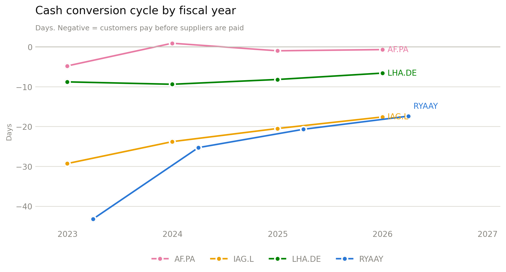

# Working capital & the cash cycle

<p class="lede">An airline collects from passengers before it flies them and pays its suppliers afterwards. That gap is free funding. This page measures it, and shows it closing.</p>

## The metric

The cash conversion cycle is the number of days between paying for an input and collecting the cash it generates:

```text
CCC = DSO + DIO - DPO
```

- **DSO** — days sales outstanding, `receivables / revenue × 365`. How long customers take to pay.
- **DIO** — days inventory outstanding, `inventory / COGS × 365`. How long stock sits. For an airline this is spares and catering, not a saleable product.
- **DPO** — days payable outstanding, `payables / COGS × 365`. How long the carrier takes to pay suppliers.

A **negative** CCC means suppliers finance operations: cash arrives before it leaves. Every carrier here is negative. That is structural to the industry — tickets are prepaid — not a sign of unusual discipline.

## Latest fiscal year

| Ticker | DSO | DIO | DPO | CCC |
|---|---|---|---|---|
| RYAAY | 1.0 | 0.1 | 18.5 | **-17.4** |
| IAG.L | 14.8 | 10.3 | 42.7 | **-17.6** |
| LHA.DE | 22.2 | 17.3 | 46.1 | **-6.6** |
| AF.PA | 24.5 | 14.4 | 39.6 | **-0.7** |

Two distinct business models show up in the columns. Ryanair collects in **1 day** — direct-to-consumer, card-on-file, no travel-agent receivables, no interline settlement — and holds essentially no inventory. The legacy carriers collect in three to four weeks because a large share of revenue moves through agents, corporate accounts and IATA clearing.

Ryanair reaches the same CCC as IAG from the opposite direction: IAG stretches payables to 42.7 days to offset a 15-day collection lag, while Ryanair simply has almost no lag to offset.

## Four-year history

<figure markdown>
  
  <figcaption>Component days and the resulting cycle. The CCC panel is the sum of the other three, signed.</figcaption>
</figure>

The direction is the same everywhere:

| Ticker | CCC, earliest FY | CCC, latest FY | Change |
|---|---|---|---|
| RYAAY | -43.2 | -17.4 | +25.8 days |
| IAG.L | -29.3 | -17.6 | +11.7 days |
| LHA.DE | -8.8 | -6.6 | +2.2 days |
| AF.PA | -4.8 | -0.7 | +4.1 days |

Every carrier's cycle moved toward zero, and the driver is almost entirely **DPO compression**, not slower collection:

- Ryanair's payables fell from 45.5 to 18.5 days — a 27-day swing that accounts for essentially all of its 25.8-day CCC deterioration. Its DSO actually *improved*, from 2.0 to 1.0 days.
- IAG's payables fell from 57.1 to 42.7 days, partly offset by faster collection (21.0 → 14.8 DSO).
- Lufthansa's payables fell from 55.0 to 46.1 days while inventory days rose from 10.9 to 17.3 — the spares build shows up directly in the cycle.

Falling DPO across four unrelated carriers in the same window is more likely a supplier-side story than four independent policy changes: post-pandemic, suppliers with backlogs and pricing power (airframers, engine shops, ground handlers) have less reason to extend terms.

!!! note "What this does and doesn't mean"
    A shorter negative cycle means less free supplier funding, which matters most exactly when a carrier is under stress and drawing on it. It is not a solvency signal on its own — Air France-KLM's CCC of -0.7 days is not a crisis, it just means the working-capital cushion the model relies on has gone. The [stress test](stress-test.md) is where that cushion gets priced.

## Data

- [`working_capital_ratios.csv`](assets/working_capital_ratios.csv) — all 16 carrier-years, every ratio on this page and the [liquidity page](liquidity.md).
